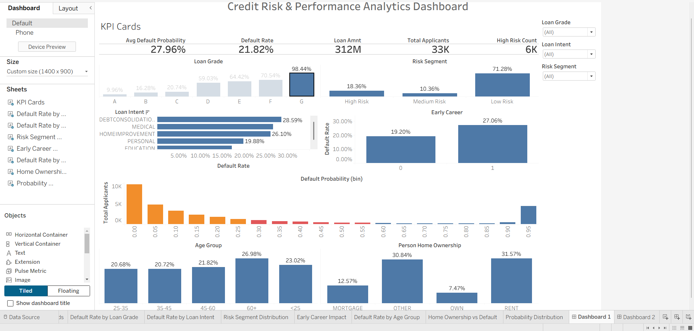

# 📊 Credit Risk & Performance Analytics Dashboard



## 🎯 Business Problem & Project Motivation
Financial institutions face significant challenges in assessing the risk of loan defaults. Approving a high-risk loan leads to financial losses, while rejecting a low-risk loan means lost revenue. 

**Why was this project made?**  
The goal of this project is to build an end-to-end **Credit Risk Analytics Solution**. By combining Machine Learning with interactive Business Intelligence (BI) dashboards, this project provides a data-driven approach to:
1. **Predict** the probability of an applicant defaulting on their loan.
2. **Identify** the key demographic and financial drivers of credit risk.
3. **Segment** customers into actionable risk categories (Low, Medium, High).
4. **Visualize** the portfolio risk for decision-makers.

---

## 🛠️ What Was Done (The Workflow)

1. **Data Preparation & Cleaning (`notebooks/01_data_preparation...`)**
   - Handled missing values and removed unrealistic outliers.
   - Standardized data formats for consistency.
2. **Feature Engineering**
   - Created new financial indicators such as the *Debt-to-Income ratio*, *Early Career flags*, and *Employment Stability groups*.
3. **Machine Learning Model Training (`notebooks/02_model_training...`)**
   - Trained several classification models (Logistic Regression, Random Forest).
   - Selected **XGBoost** as the final model due to its high performance and ability to handle non-linear relationships.
   - Extracted **Probability of Default (PD)** for every applicant.
4. **Business Intelligence (Tableau Dashboard)**
   - Built a highly interactive Tableau dashboard to present the model's findings and the overall portfolio risk to stakeholders.

---

## 📈 Dashboard & Graph Interpretations

The Tableau dashboard provides a comprehensive view of the loan portfolio. Here is a breakdown of the key visualizations and what they mean:

### 1. Data Information & Demographics

**Interpretation:** This section provides a high-level overview of the applicant pool. It helps stakeholders understand the distribution of loan grades, average interest rates, and the baseline default rate across the entire portfolio before any advanced slicing is done.

### 2. Default Rate by Age Group

**Interpretation:** This graph segments applicants by their age bracket. It typically reveals that younger applicants (or those early in their careers) may have a higher baseline risk of default compared to established, older applicants. This insight allows lenders to adjust interest rates or require co-signers for specific age brackets.

### 3. Default Rate by Loan Intent

**Interpretation:** Not all loans are created equal. This visualization shows how the *purpose* of the loan affects the risk. For example, loans taken out for "Debt Consolidation" or "Medical Expenses" often carry a higher default rate than loans for "Home Improvement" or "Education".

### 4. Probability Distribution (Model Output)

**Interpretation:** This is the direct output of the Machine Learning model. It shows the distribution of the predicted *Probability of Default*. A healthy model will show a strong separation—most applicants clumped at the low-risk end (0-20% probability), with a distinct, smaller group flagged in the high-risk tail (80-100% probability).

---

## 📂 Project Structure

- `data/`: Contains the raw and processed datasets (ignored in Git to save space).
- `notebooks/`: Jupyter Notebooks containing the data science workflow.
- `dashboard/`: Contains the Tableau dashboard file (`.twbx`).
- `images/`: Stores all project images and dashboard screenshots.
- `requirements.txt`: Python package dependencies.

---

## 🚀 How to Run the Project

### 1. Python Environment (Data & Models)
To run the Jupyter Notebooks, you need to install the project dependencies.

```bash
# Clone the repository
git clone https://github.com/yourusername/Credit-Risk-Performance-Analytics-Dashboard.git
cd Credit-Risk-Performance-Analytics-Dashboard

# Install requirements
pip install -r requirements.txt

# Launch Jupyter
jupyter notebook
```
*Note: Run notebook `01` first to prepare the data, followed by notebook `02` to train the models.*

### 2. Tableau Dashboard (Visual Analytics)
**Tableau is required** to open and interact with the `.twbx` file.
1. Download and install [Tableau Public](https://public.tableau.com/en-us/s/) (Free) or Tableau Desktop.
2. Navigate to the `dashboard/` folder in this repository.
3. Open `Credit_Risk_Performance_Analytics_Dashboard.twbx` using Tableau.
4. Explore the interactive visualizations!
